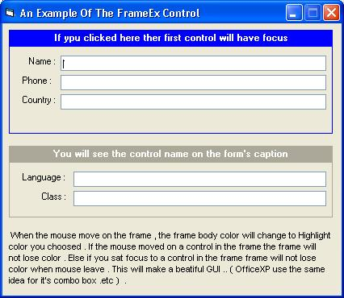



## FrameEx Control \- idea from Offixe XP

### Description

In office xp , the ComboBox control highlight when mouse move over it , and lose highlight color when mouse leave , but if combo had focus , it will not lose it's highlight color .. the same idea in the FrameEx control , hilight when mouse move on it or one of it's contained controls , and still highlighting if one of it's controls had focus .. PLEASE SEE IT AND VOTE FORM ME ..
 
### More Info
 

             |
---                |---
**Submitted On**   |2003-05-21 14:48:06
**By**             |[Abdalla Mahmoud](https://github.com/Planet-Source-Code/PSCIndex/blob/master/ByAuthor/abdalla-mahmoud.md)
**Level**          |Intermediate
**User Rating**    |4.6 (23 globes from 5 users)
**Compatibility**  |VB 5\.0, VB 6\.0
**Category**       |[Custom Controls/ Forms/  Menus](https://github.com/Planet-Source-Code/PSCIndex/blob/master/ByCategory/custom-controls-forms-menus__1-4.md)
**World**          |[Visual Basic](https://github.com/Planet-Source-Code/PSCIndex/blob/master/ByWorld/visual-basic.md)
**Archive File**   |[FrameEx\_Co1590885222003\.zip](https://github.com/Planet-Source-Code/abdalla-mahmoud-frameex-control-idea-from-offixe-xp__1-45633/archive/master.zip)

